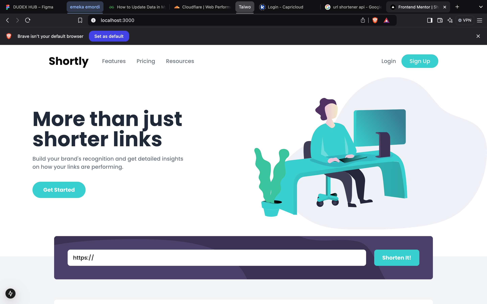

# Frontend Mentor - Shortly URL shortening API Challenge solution

This is a solution to the [Shortly URL shortening API Challenge challenge on Frontend Mentor](https://www.frontendmentor.io/challenges/url-shortening-api-landing-page-2ce3ob-G). Frontend Mentor challenges help you improve your coding skills by building realistic projects. 

## Table of contents

- [Frontend Mentor - Shortly URL shortening API Challenge solution](#frontend-mentor---shortly-url-shortening-api-challenge-solution)
  - [Table of contents](#table-of-contents)
  - [Overview](#overview)
    - [The challenge](#the-challenge)
    - [Screenshot](#screenshot)
    - [Links](#links)
  - [My process](#my-process)
    - [Built with](#built-with)
    - [What I learned](#what-i-learned)
    - [Continued development](#continued-development)
  - [Author](#author)

## Overview

### The challenge

Users should be able to:

- View the optimal layout for the site depending on their device's screen size
- Shorten any valid URL
- See a list of their shortened links, even after refreshing the browser
- Copy the shortened link to their clipboard in a single click
- Receive an error message when the `form` is submitted if:
  - The `input` field is empty

### Screenshot



### Links

- Solution URL: [Github Repository](https://github.com/codesmiles/url-shortener-fullstack-nextjs)
- Live Site URL: [Url Shortener](https://url-shortener-fullstack-nextjs-2wza.vercel.app/)

## My process

### Built with

- [TypeScript](https://www.typescriptlang.org/)
- [React](https://reactjs.org/) - JS library
- [Next.js](https://nextjs.org/) - React framework
- [TailwindCSS](https://v2.tailwindcss.com/docs) - For styles
- [Shadcn](https://ui.shadcn.com/docs) - For components
- [framer-motion](https://www.npmjs.com/package/framer-motion) - For animations

### What I learned

I am able to utilize all the tools i learned during the week to construct something and another means for me to awaken my frontend skills and get familar with nextjs recent features then and look for a more optimal way to implement a webpage using component libraries and the others

Here are some honorable mentions of what i learned.

- using the use effect to save and fech data from localstorage

```tsx
  useEffect(() => {
    const savedLinks = localStorage.getItem('shortenedLinks');
    if (savedLinks) {
      setShortenedLinks(JSON.parse(savedLinks));
    }
  }, []);

  useEffect(() => {
    localStorage.setItem("shortenedLinks", JSON.stringify(shortenedLinks));
  }, [shortenedLinks]);

```

- Having a component passi in a function as a props and when the function is called it will do something outside the component

```tsx
interface ShortenedLink {
  original: string;
  shortened: string;
}
const Statistics = () => {
  const [shortenedLinks, setShortenedLinks] = useState<ShortenedLink[]>([]);
    const handleNewLink = (original: string, shortened: string) => {
    setShortenedLinks(prev => [{ original, shortened }, ...prev]);
  };
 return (
  <Shortener onLinkShortened={handleNewLink} />
 );
}

```

- Have to use framer-motion 

```tsx
      <motion.div 
        className="absolute -top-8 left-1/2 md:left-8 transform -translate-x-1/2 md:translate-x-0"
        whileHover={{ 
          rotate: [0, -10, 10, -10, 0],
          transition: { duration: 0.5 }
        }}
      >
        <div className="bg-[hsl(257,27%,26%)] p-4 rounded-full">
          <Image src={icon} alt="" width={40} height={40} />
        </div>
      </motion.div>
```

### Continued development

I need to use more of the necessary hooks and also transitions and animations when it is needed


## Author

- Frontend Mentor - [@codesmiles](https://www.frontendmentor.io/profile/codesmiles)
- Twitter - [@codesmiles_](https://www.twitter.com/codesmiles_)
- GitHub - [@codesmiles](https://www.github.com/codesmiles)
